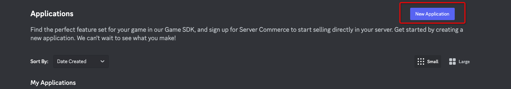
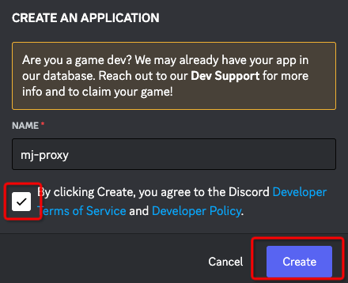
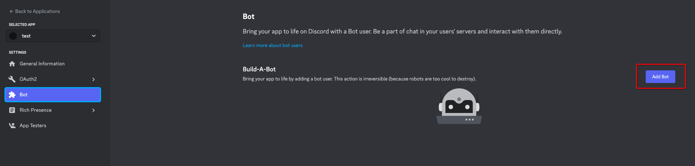
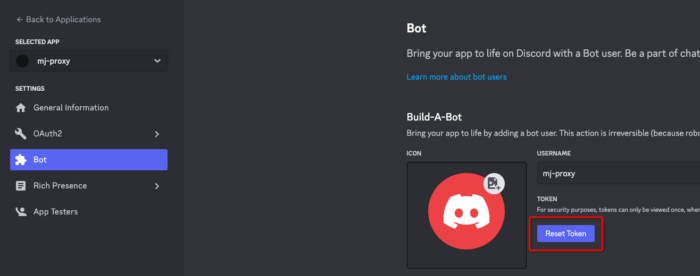
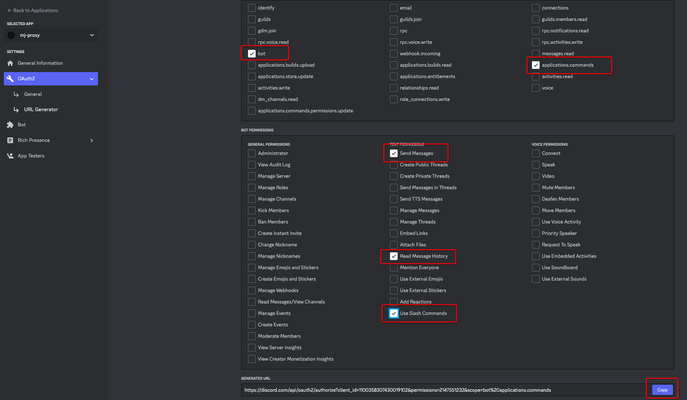
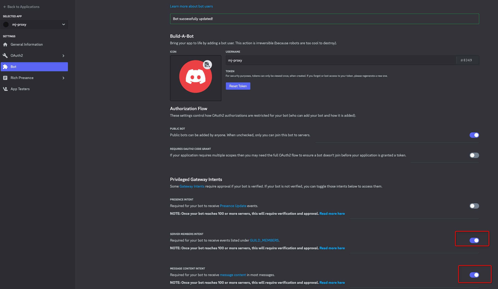
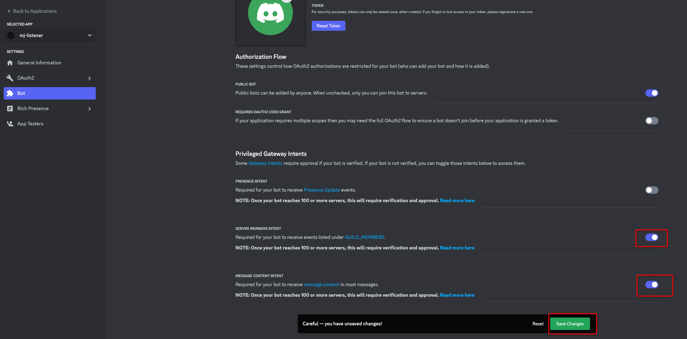

## discord 添加机器人

### 1. 创建应用

https://discord.com/developers/applications

### 2. 获取机器人Token

刷新token后显示，即机器人Token，后续配置到 `mj.discord.bot-token`

### 3. 机器人授权

如图勾选后，打开url进行授权

选择Midjourney Bot所在的服务器

勾上这两个选项，点击 `Save Changes`

### 4. 检查机器人
在频道中确认是否存在mj机器人和新创建的机器人

若不存在，把 MidJourney Bot 邀请到要让它作图的频道， 把自己的 bot 也拉到 MidJourney Bot 所在的频道

Edit Channel -> Permissions -> Add Members or roles；Member下面选中bot名字，按 Done 按钮