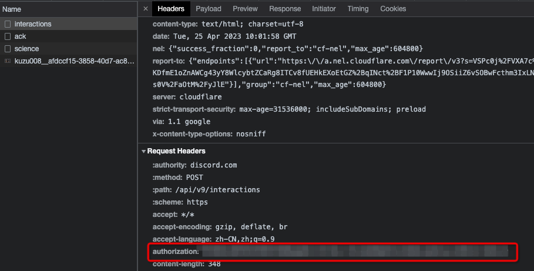
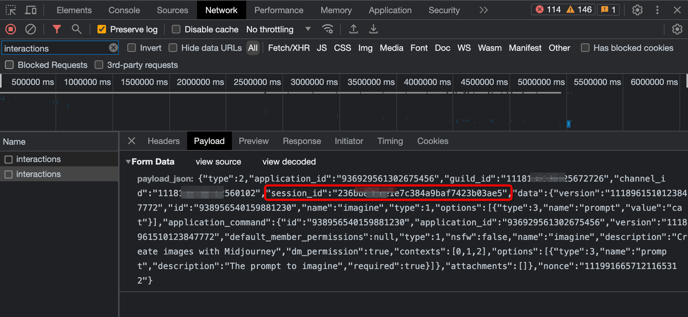
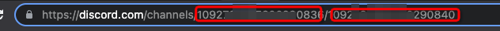

## 获取discord配置参数

### 1. 获取用户Token
进入频道，打开network，刷新页面，找到 `messages` 的请求，这里的 authorization 即用户Token，后续设置到 `mj.discord.user-token`

### 2. 获取用户sessionId
进入频道，打开network，发送/imagine作图指令，找到 `interactions` 的请求，这里的 session_id 即用户sessionId，后续设置到 `mj.discord.session-id`

### 3. 获取服务器ID、频道ID

频道的url里取出 服务器ID、频道ID，后续设置到配置项

