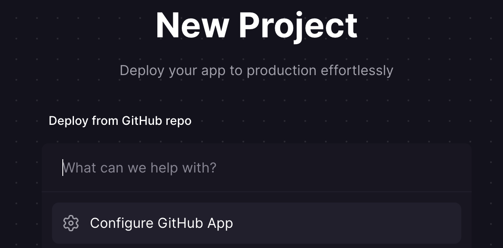
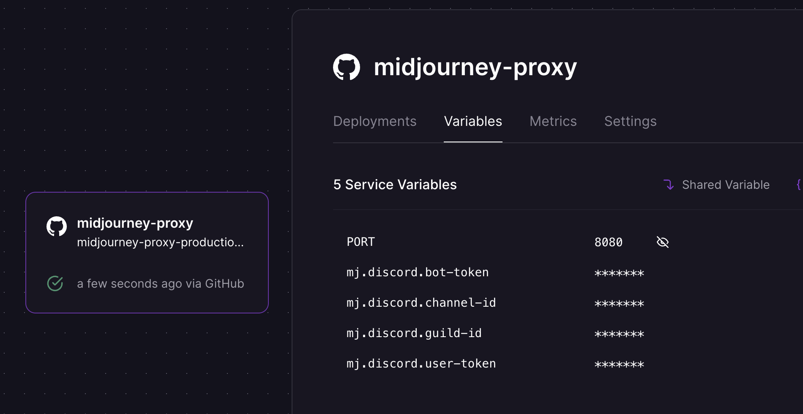

## Railway 部署教程

### 0. Railway是什么
Railway是一个提供了弹性部署方案的平台，基于Dockerfile可以方便地一键部署。而且服务就架设在海外，方便了Midjourney的调用。

### 1. fork仓库
理论上直接用公开仓库的网址就可以，但是实测发现，如果直接用原仓库而不是自己的仓库，Railway可能会识别不到Dockerfile。

### 2. Railway绑定Github

可以直接用Github账号登录Railway

新建一个Project，然后添加Railway对Github刚才fork的仓库的权限

### 3. Start the Service

进入刚才的Project，它应该已经在自动deploy了。这里先别管它的deploy，我们还需要配置变量。

要配置bot-token，channel-id等容器要求的变量，注意这里还需要配置`PORT`为8080，和docker内设置的一致。

配置之后会自动redeploy

### 4. Enjoy

基于docker启动的应该没什么问题，然后在这里配置网址，之后就可以通过这个网址访问啦。比如

`https://midjourney-proxy-***.app/mj`

