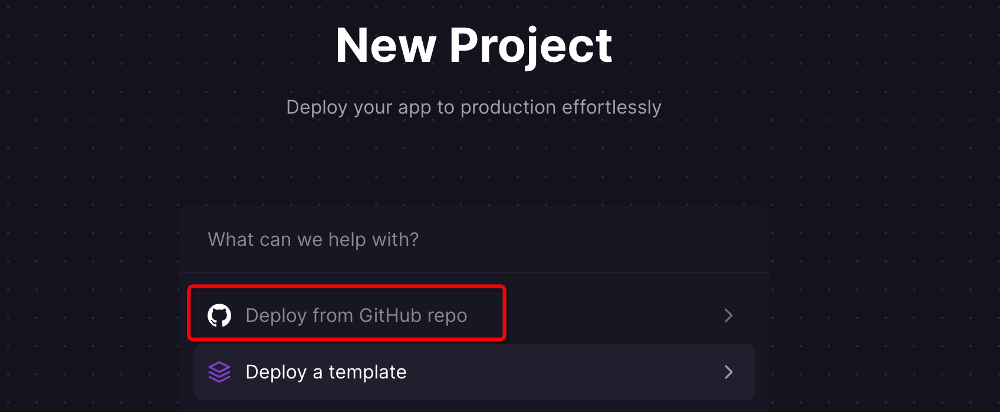
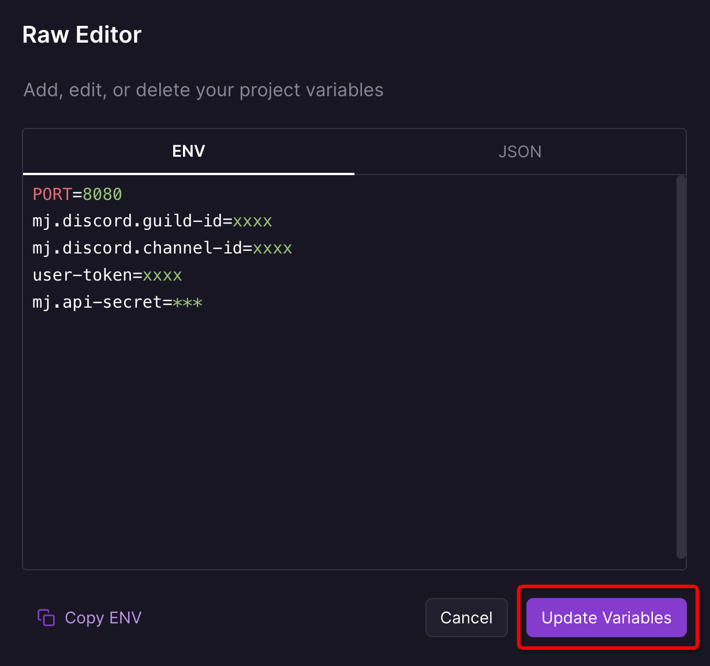
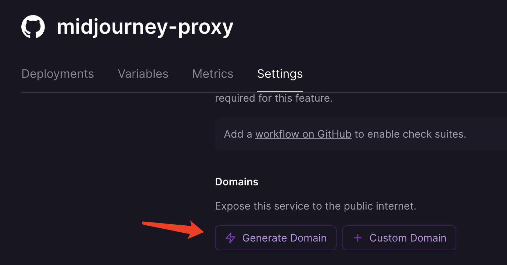

## Railway 部署教程

Railway是一个提供弹性部署方案的平台，服务器在海外，方便MidJourney的调用。

**Railway 提供 5 美元，500 个小时/月的免费额度**

### 1. Fork本仓库
### 2. Railway使用github账号登录
进入 [railway官网](https://railway.app) 选择 `Login` -> `Github`，登录github账号

### 3. [New Project](https://railway.app/new) 添加对fork仓库的授权

### 4. 选择该fork仓库，新建项目，设置环境变量

此处配置项参考 [Wiki / 配置项](https://github.com/novicezk/midjourney-proxy/wiki/%E9%85%8D%E7%BD%AE%E9%A1%B9) ，建议配置api密钥启用鉴权，接口调用时需添加请求头 `mj-api-secret`

### 5. 启动服务
进入刚才的Project，它应该已经在自动部署了，后续更新配置之后会自动重新部署

若部署启动失败请查看日志，检查配置项

### 6. 开始使用
等待部署成功后，生成随机域名

访问 `https://midjourney-proxy-***.app/mj`
